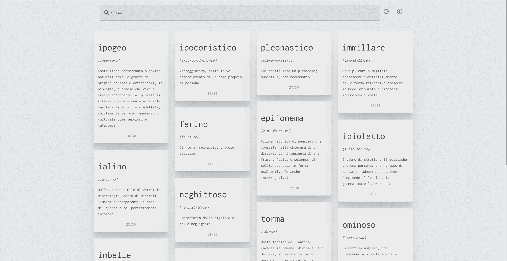

# verba

[](https://github.com/maku85/verba/actions/workflows/ci.yml)


<p align="center">
  <br>
  
  <br>
</p>

Project demo is available <a href="http://www.maurocunsolo.com/verba">here</a>.

## Build Setup

```bash
# install dependencies
$ npm install

# serve with hot reload at localhost:3000
$ npm run dev

# build for production and launch server
$ npm run build
$ npm run start

# generate static project
$ npm run generate
```

For detailed explanation on how things work, check out the [documentation](https://nuxtjs.org).
